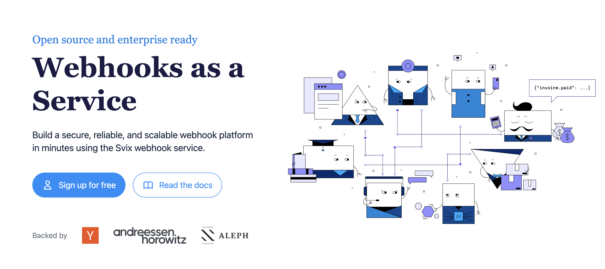

<div align="left">

[](https://svix.com)

# [Svix](https://svix.com)<a id="svix"></a>

Welcome to the Svix API documentation!

Useful links: [Homepage](https://www.svix.com) | [Support email](mailto:support+docs@svix.com) | [Blog](https://www.svix.com/blog/) | [Slack Community](https://www.svix.com/slack/)

# Introduction<a id="introduction"></a>

This is the reference documentation and schemas for the [Svix webhook service](https://www.svix.com) API. For tutorials and other documentation please refer to [the documentation](https://docs.svix.com).

## Main concepts<a id="main-concepts"></a>

In Svix you have four important entities you will be interacting with:

- `messages`: these are the webhooks being sent. They can have contents and a few other properties.
- `application`: this is where `messages` are sent to. Usually you want to create one application for each user on your platform.
- `endpoint`: endpoints are the URLs messages will be sent to. Each application can have multiple `endpoints` and each message sent to that application will be sent to all of them (unless they are not subscribed to the sent event type).
- `event-type`: event types are identifiers denoting the type of the message being sent. Event types are primarily used to decide which events are sent to which endpoint.


## Authentication<a id="authentication"></a>

Get your authentication token (`AUTH_TOKEN`) from the [Svix dashboard](https://dashboard.svix.com) and use it as part of the `Authorization` header as such: `Authorization: Bearer ${AUTH_TOKEN}`. For more information on authentication, please refer to the [authentication token docs](https://docs.svix.com/api-keys).


## Code samples<a id="code-samples"></a>

The code samples assume you already have the respective libraries installed and you know how to use them. For the latest information on how to do that, please refer to [the documentation](https://docs.svix.com/).


## Idempotency<a id="idempotency"></a>

Svix supports [idempotency](https://en.wikipedia.org/wiki/Idempotence) for safely retrying requests without accidentally performing the same operation twice. This is useful when an API call is disrupted in transit and you do not receive a response.

To perform an idempotent request, pass the idempotency key in the `Idempotency-Key` header to the request. The idempotency key should be a unique value generated by the client. You can create the key in however way you like, though we suggest using UUID v4, or any other string with enough entropy to avoid collisions.

Svix's idempotency works by saving the resulting status code and body of the first request made for any given idempotency key for any successful request. Subsequent requests with the same key return the same result for a period of up to 12 hours.

Please note that idempotency is only supported for `POST` requests.


## Cross-Origin Resource Sharing<a id="cross-origin-resource-sharing"></a>

This API features Cross-Origin Resource Sharing (CORS) implemented in compliance with [W3C spec](https://www.w3.org/TR/cors/). And that allows cross-domain communication from the browser. All responses have a wildcard same-origin which makes them completely public and accessible to everyone, including any code on any site.


</div>

## Table of Contents<a id="table-of-contents"></a>

<!-- toc -->

- [Installation](#installation)
- [Getting Started](#getting-started)
- [Reference](#reference)
  * [`svix.application.createNewApplication`](#svixapplicationcreatenewapplication)
  * [`svix.application.getById`](#svixapplicationgetbyid)
  * [`svix.application.listAll`](#svixapplicationlistall)
  * [`svix.application.partiallyUpdate`](#svixapplicationpartiallyupdate)
  * [`svix.application.removeApp`](#svixapplicationremoveapp)
  * [`svix.application.updateApp`](#svixapplicationupdateapp)
  * [`svix.authentication.expireAppTokens`](#svixauthenticationexpireapptokens)
  * [`svix.authentication.generateMagicLink`](#svixauthenticationgeneratemagiclink)
  * [`svix.authentication.obtainMagicLinkAndCode`](#svixauthenticationobtainmagiclinkandcode)
  * [`svix.authentication.revokeToken`](#svixauthenticationrevoketoken)
  * [`svix.backgroundTasks.getTaskById`](#svixbackgroundtasksgettaskbyid)
  * [`svix.backgroundTasks.listRecentTasks`](#svixbackgroundtaskslistrecenttasks)
  * [`svix.endpoint.createNew`](#svixendpointcreatenew)
  * [`svix.endpoint.getEndpoint`](#svixendpointgetendpoint)
  * [`svix.endpoint.getHeaders`](#svixendpointgetheaders)
  * [`svix.endpoint.getSecret`](#svixendpointgetsecret)
  * [`svix.endpoint.getStats`](#svixendpointgetstats)
  * [`svix.endpoint.getTransformationCode`](#svixendpointgettransformationcode)
  * [`svix.endpoint.listEndpoints`](#svixendpointlistendpoints)
  * [`svix.endpoint.partiallySetHeaders`](#svixendpointpartiallysetheaders)
  * [`svix.endpoint.partiallyUpdate`](#svixendpointpartiallyupdate)
  * [`svix.endpoint.remove`](#svixendpointremove)
  * [`svix.endpoint.replayMissingWebhooks`](#svixendpointreplaymissingwebhooks)
  * [`svix.endpoint.resendFailedWebhooks`](#svixendpointresendfailedwebhooks)
  * [`svix.endpoint.rotateSecret`](#svixendpointrotatesecret)
  * [`svix.endpoint.sendExampleMessage`](#svixendpointsendexamplemessage)
  * [`svix.endpoint.setTransformationCode`](#svixendpointsettransformationcode)
  * [`svix.endpoint.updateEndpoint`](#svixendpointupdateendpoint)
  * [`svix.endpoint.updateHeaders`](#svixendpointupdateheaders)
  * [`svix.eventType.archiveType`](#svixeventtypearchivetype)
  * [`svix.eventType.createOrUpdate`](#svixeventtypecreateorupdate)
  * [`svix.eventType.getByName`](#svixeventtypegetbyname)
  * [`svix.eventType.getList`](#svixeventtypegetlist)
  * [`svix.eventType.importFromOpenapi`](#svixeventtypeimportfromopenapi)
  * [`svix.eventType.partiallyUpdateType`](#svixeventtypepartiallyupdatetype)
  * [`svix.eventType.updateType`](#svixeventtypeupdatetype)
  * [`svix.health.checkServerStatus`](#svixhealthcheckserverstatus)
  * [`svix.integration.createNewIntegration`](#svixintegrationcreatenewintegration)
  * [`svix.integration.deleteById`](#svixintegrationdeletebyid)
  * [`svix.integration.getById`](#svixintegrationgetbyid)
  * [`svix.integration.getKey`](#svixintegrationgetkey)
  * [`svix.integration.listIntegrations`](#svixintegrationlistintegrations)
  * [`svix.integration.rotateIntegrationKey`](#svixintegrationrotateintegrationkey)
  * [`svix.integration.updateIntegration`](#svixintegrationupdateintegration)
  * [`svix.message.createNew`](#svixmessagecreatenew)
  * [`svix.message.deletePayload`](#svixmessagedeletepayload)
  * [`svix.message.getByIdOrEventId`](#svixmessagegetbyidoreventid)
  * [`svix.message.listAllMessages`](#svixmessagelistallmessages)
  * [`svix.messageAttempt.deleteResponseBody`](#svixmessageattemptdeleteresponsebody)
  * [`svix.messageAttempt.getByDestination`](#svixmessageattemptgetbydestination)
  * [`svix.messageAttempt.listAttemptedDestinations`](#svixmessageattemptlistattempteddestinations)
  * [`svix.messageAttempt.listAttemptedMessages`](#svixmessageattemptlistattemptedmessages)
  * [`svix.messageAttempt.listByEndpoint`](#svixmessageattemptlistbyendpoint)
  * [`svix.messageAttempt.listByEndpointDeprecated`](#svixmessageattemptlistbyendpointdeprecated)
  * [`svix.messageAttempt.listByMsgAttemptedDestinations`](#svixmessageattemptlistbymsgattempteddestinations)
  * [`svix.messageAttempt.listByMsgAttemptedDestinations_0`](#svixmessageattemptlistbymsgattempteddestinations_0)
  * [`svix.messageAttempt.resendMessageToEndpoint`](#svixmessageattemptresendmessagetoendpoint)
  * [`svix.statistics.calculateEventTypesForAllApps`](#svixstatisticscalculateeventtypesforallapps)
  * [`svix.statistics.calculateMessageDestinations`](#svixstatisticscalculatemessagedestinations)

<!-- tocstop -->

## Installation<a id="installation"></a>
<div align="center">
  <a href="https://konfigthis.com/sdk-sign-up?company=Svix&language=TypeScript">
    
  </a>
</div>

## Getting Started<a id="getting-started"></a>

```typescript
import { Svix } from "svix-typescript-sdk";

const svix = new Svix({
  // Defining the base path is optional and defaults to https://api.eu.svix.com
  // basePath: "https://api.eu.svix.com",
  accessToken: "ACCESS_TOKEN",
});

const createNewApplicationResponse =
  await svix.application.createNewApplication({
    getIfExists: false,
    name: "My first application",
    uid: "unique-app-identifier",
  });

console.log(createNewApplicationResponse);
```

## Reference<a id="reference"></a>


### `svix.application.createNewApplication`<a id="svixapplicationcreatenewapplication"></a>

Create a new application.

#### 🛠️ Usage<a id="🛠️-usage"></a>

```typescript
const createNewApplicationResponse =
  await svix.application.createNewApplication({
    getIfExists: false,
    name: "My first application",
    uid: "unique-app-identifier",
  });
```

#### ⚙️ Parameters<a id="⚙️-parameters"></a>

##### name: `string`<a id="name-string"></a>

##### rateLimit: `number`<a id="ratelimit-number"></a>

##### uid: `string`<a id="uid-string"></a>

Optional unique identifier for the application

##### metadata: Record<string, `string`><a id="metadata-record"></a>

##### getIfExists: `boolean`<a id="getifexists-boolean"></a>

Get an existing application, or create a new one if doesn\'t exist. It\'s two separate functions in the libs.

##### idempotencyKey: `string`<a id="idempotencykey-string"></a>

The request\'s idempotency key

#### 🔄 Return<a id="🔄-return"></a>

[ApplicationOut](./models/application-out.ts)

#### 🌐 Endpoint<a id="🌐-endpoint"></a>

`/api/v1/app` `POST`

[🔙 **Back to Table of Contents**](#table-of-contents)

---


### `svix.application.getById`<a id="svixapplicationgetbyid"></a>

Get an application.

#### 🛠️ Usage<a id="🛠️-usage"></a>

```typescript
const getByIdResponse = await svix.application.getById({
  appId: "unique-app-identifier",
});
```

#### ⚙️ Parameters<a id="⚙️-parameters"></a>

##### appId: `string`<a id="appid-string"></a>

The app\'s ID or UID

#### 🔄 Return<a id="🔄-return"></a>

[ApplicationOut](./models/application-out.ts)

#### 🌐 Endpoint<a id="🌐-endpoint"></a>

`/api/v1/app/{app_id}` `GET`

[🔙 **Back to Table of Contents**](#table-of-contents)

---


### `svix.application.listAll`<a id="svixapplicationlistall"></a>

List of all the organization's applications.

#### 🛠️ Usage<a id="🛠️-usage"></a>

```typescript
const listAllResponse = await svix.application.listAll({
  iterator: "app_1srOrx2ZWZBpBUvZwXKQmoEYga2",
  order: "ascending",
});
```

#### ⚙️ Parameters<a id="⚙️-parameters"></a>

##### limit: `number`<a id="limit-number"></a>

Limit the number of returned items

##### iterator: `string`<a id="iterator-string"></a>

The iterator returned from a prior invocation

##### order: [`Ordering`](./models/ordering.ts)<a id="order-orderingmodelsorderingts"></a>

The sorting order of the returned items

#### 🔄 Return<a id="🔄-return"></a>

[ListResponseApplicationOut](./models/list-response-application-out.ts)

#### 🌐 Endpoint<a id="🌐-endpoint"></a>

`/api/v1/app` `GET`

[🔙 **Back to Table of Contents**](#table-of-contents)

---


### `svix.application.partiallyUpdate`<a id="svixapplicationpartiallyupdate"></a>

Partially update an application.

#### 🛠️ Usage<a id="🛠️-usage"></a>

```typescript
const partiallyUpdateResponse = await svix.application.partiallyUpdate({
  appId: "unique-app-identifier",
  uid: "unique-app-identifier",
});
```

#### ⚙️ Parameters<a id="⚙️-parameters"></a>

##### appId: `string`<a id="appid-string"></a>

The app\'s ID or UID

##### name: `string`<a id="name-string"></a>

##### rateLimit: `number`<a id="ratelimit-number"></a>

##### uid: `string`<a id="uid-string"></a>

The app\\\'s UID

##### metadata: Record<string, `string`><a id="metadata-record"></a>

#### 🔄 Return<a id="🔄-return"></a>

[ApplicationOut](./models/application-out.ts)

#### 🌐 Endpoint<a id="🌐-endpoint"></a>

`/api/v1/app/{app_id}` `PATCH`

[🔙 **Back to Table of Contents**](#table-of-contents)

---


### `svix.application.removeApp`<a id="svixapplicationremoveapp"></a>

Delete an application.

#### 🛠️ Usage<a id="🛠️-usage"></a>

```typescript
const removeAppResponse = await svix.application.removeApp({
  appId: "unique-app-identifier",
});
```

#### ⚙️ Parameters<a id="⚙️-parameters"></a>

##### appId: `string`<a id="appid-string"></a>

The app\'s ID or UID

#### 🌐 Endpoint<a id="🌐-endpoint"></a>

`/api/v1/app/{app_id}` `DELETE`

[🔙 **Back to Table of Contents**](#table-of-contents)

---


### `svix.application.updateApp`<a id="svixapplicationupdateapp"></a>

Update an application.

#### 🛠️ Usage<a id="🛠️-usage"></a>

```typescript
const updateAppResponse = await svix.application.updateApp({
  appId: "unique-app-identifier",
  name: "My first application",
  uid: "unique-app-identifier",
});
```

#### ⚙️ Parameters<a id="⚙️-parameters"></a>

##### name: `string`<a id="name-string"></a>

##### appId: `string`<a id="appid-string"></a>

The app\'s ID or UID

##### rateLimit: `number`<a id="ratelimit-number"></a>

##### uid: `string`<a id="uid-string"></a>

Optional unique identifier for the application

##### metadata: Record<string, `string`><a id="metadata-record"></a>

#### 🔄 Return<a id="🔄-return"></a>

[ApplicationOut](./models/application-out.ts)

#### 🌐 Endpoint<a id="🌐-endpoint"></a>

`/api/v1/app/{app_id}` `PUT`

[🔙 **Back to Table of Contents**](#table-of-contents)

---


### `svix.authentication.expireAppTokens`<a id="svixauthenticationexpireapptokens"></a>

Expire all of the tokens associated with a specific Application

#### 🛠️ Usage<a id="🛠️-usage"></a>

```typescript
const expireAppTokensResponse = await svix.authentication.expireAppTokens({
  appId: "unique-app-identifier",
  expiry: 60,
});
```

#### ⚙️ Parameters<a id="⚙️-parameters"></a>

##### appId: `string`<a id="appid-string"></a>

The app\'s ID or UID

##### expiry: `number`<a id="expiry-number"></a>

How many seconds until the old key is expired.

##### idempotencyKey: `string`<a id="idempotencykey-string"></a>

The request\'s idempotency key

#### 🌐 Endpoint<a id="🌐-endpoint"></a>

`/api/v1/auth/app/{app_id}/expire-all` `POST`

[🔙 **Back to Table of Contents**](#table-of-contents)

---


### `svix.authentication.generateMagicLink`<a id="svixauthenticationgeneratemagiclink"></a>

DEPRECATED: Please use `app-portal-access` instead.

Use this function to get magic links (and authentication codes) for connecting your users to the Consumer Application Portal.

#### 🛠️ Usage<a id="🛠️-usage"></a>

```typescript
const generateMagicLinkResponse = await svix.authentication.generateMagicLink({
  appId: "unique-app-identifier",
});
```

#### ⚙️ Parameters<a id="⚙️-parameters"></a>

##### appId: `string`<a id="appid-string"></a>

The app\'s ID or UID

##### idempotencyKey: `string`<a id="idempotencykey-string"></a>

The request\'s idempotency key

#### 🔄 Return<a id="🔄-return"></a>

[DashboardAccessOut](./models/dashboard-access-out.ts)

#### 🌐 Endpoint<a id="🌐-endpoint"></a>

`/api/v1/auth/dashboard-access/{app_id}` `POST`

[🔙 **Back to Table of Contents**](#table-of-contents)

---


### `svix.authentication.obtainMagicLinkAndCode`<a id="svixauthenticationobtainmagiclinkandcode"></a>

Use this function to get magic links (and authentication codes) for connecting your users to the Consumer Application Portal.

#### 🛠️ Usage<a id="🛠️-usage"></a>

```typescript
const obtainMagicLinkAndCodeResponse =
  await svix.authentication.obtainMagicLinkAndCode({
    appId: "unique-app-identifier",
    featureFlags: [],
    expiry: 604800,
  });
```

#### ⚙️ Parameters<a id="⚙️-parameters"></a>

##### appId: `string`<a id="appid-string"></a>

The app\'s ID or UID

##### featureFlags: `string`[]<a id="featureflags-string"></a>

The set of feature flags the created token will have access to.

##### expiry: `number`<a id="expiry-number"></a>

How long the token will be valid for, in seconds. Valid values are between 1 hour and 7 days. The default is 7 days.

##### idempotencyKey: `string`<a id="idempotencykey-string"></a>

The request\'s idempotency key

#### 🔄 Return<a id="🔄-return"></a>

[AppPortalAccessOut](./models/app-portal-access-out.ts)

#### 🌐 Endpoint<a id="🌐-endpoint"></a>

`/api/v1/auth/app-portal-access/{app_id}` `POST`

[🔙 **Back to Table of Contents**](#table-of-contents)

---


### `svix.authentication.revokeToken`<a id="svixauthenticationrevoketoken"></a>

Logout an app token.

Trying to log out other tokens will fail.

#### 🛠️ Usage<a id="🛠️-usage"></a>

```typescript
const revokeTokenResponse = await svix.authentication.revokeToken({});
```

#### ⚙️ Parameters<a id="⚙️-parameters"></a>

##### idempotencyKey: `string`<a id="idempotencykey-string"></a>

The request\'s idempotency key

#### 🌐 Endpoint<a id="🌐-endpoint"></a>

`/api/v1/auth/logout` `POST`

[🔙 **Back to Table of Contents**](#table-of-contents)

---


### `svix.backgroundTasks.getTaskById`<a id="svixbackgroundtasksgettaskbyid"></a>

Get a background task by ID.

#### 🛠️ Usage<a id="🛠️-usage"></a>

```typescript
const getTaskByIdResponse = await svix.backgroundTasks.getTaskById({
  taskId: "taskId_example",
});
```

#### ⚙️ Parameters<a id="⚙️-parameters"></a>

##### taskId: `string`<a id="taskid-string"></a>

#### 🔄 Return<a id="🔄-return"></a>

[BackgroundTaskOut](./models/background-task-out.ts)

#### 🌐 Endpoint<a id="🌐-endpoint"></a>

`/api/v1/background-task/{task_id}` `GET`

[🔙 **Back to Table of Contents**](#table-of-contents)

---


### `svix.backgroundTasks.listRecentTasks`<a id="svixbackgroundtaskslistrecenttasks"></a>

List background tasks executed in the past 90 days.

#### 🛠️ Usage<a id="🛠️-usage"></a>

```typescript
const listRecentTasksResponse = await svix.backgroundTasks.listRecentTasks({
  status: "running",
  task: "endpoint.replay",
  order: "ascending",
});
```

#### ⚙️ Parameters<a id="⚙️-parameters"></a>

##### status: [`BackgroundTaskStatus`](./models/background-task-status.ts)<a id="status-backgroundtaskstatusmodelsbackground-task-statusts"></a>

Filter the response based on the status

##### task: [`BackgroundTaskType`](./models/background-task-type.ts)<a id="task-backgroundtasktypemodelsbackground-task-typets"></a>

Filter the response based on the type

##### limit: `number`<a id="limit-number"></a>

Limit the number of returned items

##### iterator: `string`<a id="iterator-string"></a>

The iterator returned from a prior invocation

##### order: [`Ordering`](./models/ordering.ts)<a id="order-orderingmodelsorderingts"></a>

The sorting order of the returned items

#### 🔄 Return<a id="🔄-return"></a>

[ListResponseBackgroundTaskOut](./models/list-response-background-task-out.ts)

#### 🌐 Endpoint<a id="🌐-endpoint"></a>

`/api/v1/background-task` `GET`

[🔙 **Back to Table of Contents**](#table-of-contents)

---


### `svix.endpoint.createNew`<a id="svixendpointcreatenew"></a>

Create a new endpoint for the application.

When `secret` is `null` the secret is automatically generated (recommended)

#### 🛠️ Usage<a id="🛠️-usage"></a>

```typescript
const createNewResponse = await svix.endpoint.createNew({
  appId: "unique-app-identifier",
  description: "An example endpoint name",
  version: 1,
  uid: "unique-ep-identifier",
  url: "https://example.com/webhook/",
  disabled: false,
  filterTypes: ["user.signup", "user.deleted"],
  channels: ["project_123", "group_2"],
  secret: "whsec_C2FVsBQIhrscChlQIMV+b5sSYspob7oD",
});
```

#### ⚙️ Parameters<a id="⚙️-parameters"></a>

##### url: `string`<a id="url-string"></a>

##### appId: `string`<a id="appid-string"></a>

The app\'s ID or UID

##### description: `string`<a id="description-string"></a>

##### version: `number`<a id="version-number"></a>

##### rateLimit: `number`<a id="ratelimit-number"></a>

##### uid: `string`<a id="uid-string"></a>

Optional unique identifier for the endpoint

##### disabled: `boolean`<a id="disabled-boolean"></a>

##### filterTypes: `string`[]<a id="filtertypes-string"></a>

##### channels: `string`[]<a id="channels-string"></a>

List of message channels this endpoint listens to (omit for all)

##### secret: `string`<a id="secret-string"></a>

The endpoint\\\'s verification secret. If `null` is passed, a secret is automatically generated. Format: `base64` encoded random bytes optionally prefixed with `whsec_`. Recommended size: 24.

##### metadata: Record<string, `string`><a id="metadata-record"></a>

##### idempotencyKey: `string`<a id="idempotencykey-string"></a>

The request\'s idempotency key

#### 🔄 Return<a id="🔄-return"></a>

[EndpointOut](./models/endpoint-out.ts)

#### 🌐 Endpoint<a id="🌐-endpoint"></a>

`/api/v1/app/{app_id}/endpoint` `POST`

[🔙 **Back to Table of Contents**](#table-of-contents)

---


### `svix.endpoint.getEndpoint`<a id="svixendpointgetendpoint"></a>

Get an endpoint.

#### 🛠️ Usage<a id="🛠️-usage"></a>

```typescript
const getEndpointResponse = await svix.endpoint.getEndpoint({
  appId: "unique-app-identifier",
  endpointId: "unique-ep-identifier",
});
```

#### ⚙️ Parameters<a id="⚙️-parameters"></a>

##### appId: `string`<a id="appid-string"></a>

The app\'s ID or UID

##### endpointId: `string`<a id="endpointid-string"></a>

The ep\'s ID or UID

#### 🔄 Return<a id="🔄-return"></a>

[EndpointOut](./models/endpoint-out.ts)

#### 🌐 Endpoint<a id="🌐-endpoint"></a>

`/api/v1/app/{app_id}/endpoint/{endpoint_id}` `GET`

[🔙 **Back to Table of Contents**](#table-of-contents)

---


### `svix.endpoint.getHeaders`<a id="svixendpointgetheaders"></a>

Get the additional headers to be sent with the webhook

#### 🛠️ Usage<a id="🛠️-usage"></a>

```typescript
const getHeadersResponse = await svix.endpoint.getHeaders({
  appId: "unique-app-identifier",
  endpointId: "unique-ep-identifier",
});
```

#### ⚙️ Parameters<a id="⚙️-parameters"></a>

##### appId: `string`<a id="appid-string"></a>

The app\'s ID or UID

##### endpointId: `string`<a id="endpointid-string"></a>

The ep\'s ID or UID

#### 🔄 Return<a id="🔄-return"></a>

[EndpointHeadersOut](./models/endpoint-headers-out.ts)

#### 🌐 Endpoint<a id="🌐-endpoint"></a>

`/api/v1/app/{app_id}/endpoint/{endpoint_id}/headers` `GET`

[🔙 **Back to Table of Contents**](#table-of-contents)

---


### `svix.endpoint.getSecret`<a id="svixendpointgetsecret"></a>

Get the endpoint's signing secret.

This is used to verify the authenticity of the webhook.
For more information please refer to [the consuming webhooks docs](https://docs.svix.com/consuming-webhooks/).

#### 🛠️ Usage<a id="🛠️-usage"></a>

```typescript
const getSecretResponse = await svix.endpoint.getSecret({
  appId: "unique-app-identifier",
  endpointId: "unique-ep-identifier",
});
```

#### ⚙️ Parameters<a id="⚙️-parameters"></a>

##### appId: `string`<a id="appid-string"></a>

The app\'s ID or UID

##### endpointId: `string`<a id="endpointid-string"></a>

The ep\'s ID or UID

#### 🔄 Return<a id="🔄-return"></a>

[EndpointSecretOut](./models/endpoint-secret-out.ts)

#### 🌐 Endpoint<a id="🌐-endpoint"></a>

`/api/v1/app/{app_id}/endpoint/{endpoint_id}/secret` `GET`

[🔙 **Back to Table of Contents**](#table-of-contents)

---


### `svix.endpoint.getStats`<a id="svixendpointgetstats"></a>

Get basic statistics for the endpoint.

#### 🛠️ Usage<a id="🛠️-usage"></a>

```typescript
const getStatsResponse = await svix.endpoint.getStats({
  appId: "unique-app-identifier",
  endpointId: "unique-ep-identifier",
});
```

#### ⚙️ Parameters<a id="⚙️-parameters"></a>

##### appId: `string`<a id="appid-string"></a>

The app\'s ID or UID

##### endpointId: `string`<a id="endpointid-string"></a>

The ep\'s ID or UID

##### since: `string`<a id="since-string"></a>

Filter the range to data starting from this date

##### until: `string`<a id="until-string"></a>

Filter the range to data ending by this date

#### 🔄 Return<a id="🔄-return"></a>

[EndpointStats](./models/endpoint-stats.ts)

#### 🌐 Endpoint<a id="🌐-endpoint"></a>

`/api/v1/app/{app_id}/endpoint/{endpoint_id}/stats` `GET`

[🔙 **Back to Table of Contents**](#table-of-contents)

---


### `svix.endpoint.getTransformationCode`<a id="svixendpointgettransformationcode"></a>

Get the transformation code associated with this endpoint

#### 🛠️ Usage<a id="🛠️-usage"></a>

```typescript
const getTransformationCodeResponse = await svix.endpoint.getTransformationCode(
  {
    appId: "unique-app-identifier",
    endpointId: "unique-ep-identifier",
  }
);
```

#### ⚙️ Parameters<a id="⚙️-parameters"></a>

##### appId: `string`<a id="appid-string"></a>

The app\'s ID or UID

##### endpointId: `string`<a id="endpointid-string"></a>

The ep\'s ID or UID

#### 🔄 Return<a id="🔄-return"></a>

[EndpointTransformationOut](./models/endpoint-transformation-out.ts)

#### 🌐 Endpoint<a id="🌐-endpoint"></a>

`/api/v1/app/{app_id}/endpoint/{endpoint_id}/transformation` `GET`

[🔙 **Back to Table of Contents**](#table-of-contents)

---


### `svix.endpoint.listEndpoints`<a id="svixendpointlistendpoints"></a>

List the application's endpoints.

#### 🛠️ Usage<a id="🛠️-usage"></a>

```typescript
const listEndpointsResponse = await svix.endpoint.listEndpoints({
  appId: "unique-app-identifier",
  iterator: "ep_1srOrx2ZWZBpBUvZwXKQmoEYga2",
  order: "ascending",
});
```

#### ⚙️ Parameters<a id="⚙️-parameters"></a>

##### appId: `string`<a id="appid-string"></a>

The app\'s ID or UID

##### limit: `number`<a id="limit-number"></a>

Limit the number of returned items

##### iterator: `string`<a id="iterator-string"></a>

The iterator returned from a prior invocation

##### order: [`Ordering`](./models/ordering.ts)<a id="order-orderingmodelsorderingts"></a>

The sorting order of the returned items

#### 🔄 Return<a id="🔄-return"></a>

[ListResponseEndpointOut](./models/list-response-endpoint-out.ts)

#### 🌐 Endpoint<a id="🌐-endpoint"></a>

`/api/v1/app/{app_id}/endpoint` `GET`

[🔙 **Back to Table of Contents**](#table-of-contents)

---


### `svix.endpoint.partiallySetHeaders`<a id="svixendpointpartiallysetheaders"></a>

Partially set the additional headers to be sent with the webhook

#### 🛠️ Usage<a id="🛠️-usage"></a>

```typescript
const partiallySetHeadersResponse = await svix.endpoint.partiallySetHeaders({
  appId: "unique-app-identifier",
  endpointId: "unique-ep-identifier",
  headers: {
    key: "string_example",
  },
});
```

#### ⚙️ Parameters<a id="⚙️-parameters"></a>

##### headers: Record<string, `string`><a id="headers-record"></a>

##### appId: `string`<a id="appid-string"></a>

The app\'s ID or UID

##### endpointId: `string`<a id="endpointid-string"></a>

The ep\'s ID or UID

#### 🌐 Endpoint<a id="🌐-endpoint"></a>

`/api/v1/app/{app_id}/endpoint/{endpoint_id}/headers` `PATCH`

[🔙 **Back to Table of Contents**](#table-of-contents)

---


### `svix.endpoint.partiallyUpdate`<a id="svixendpointpartiallyupdate"></a>

Partially update an endpoint.

#### 🛠️ Usage<a id="🛠️-usage"></a>

```typescript
const partiallyUpdateResponse = await svix.endpoint.partiallyUpdate({
  appId: "unique-app-identifier",
  endpointId: "unique-ep-identifier",
  version: 1,
  uid: "unique-ep-identifier",
  secret: "whsec_C2FVsBQIhrscChlQIMV+b5sSYspob7oD",
});
```

#### ⚙️ Parameters<a id="⚙️-parameters"></a>

##### appId: `string`<a id="appid-string"></a>

The app\'s ID or UID

##### endpointId: `string`<a id="endpointid-string"></a>

The ep\'s ID or UID

##### description: `string`<a id="description-string"></a>

##### version: `number`<a id="version-number"></a>

##### rateLimit: `number`<a id="ratelimit-number"></a>

##### uid: `string`<a id="uid-string"></a>

The ep\\\'s UID

##### url: `string`<a id="url-string"></a>

##### disabled: `boolean`<a id="disabled-boolean"></a>

##### filterTypes: `string`[]<a id="filtertypes-string"></a>

##### channels: `string`[]<a id="channels-string"></a>

##### secret: `string`<a id="secret-string"></a>

The endpoint\\\'s verification secret. If `null` is passed, a secret is automatically generated. Format: `base64` encoded random bytes optionally prefixed with `whsec_`. Recommended size: 24.

##### metadata: Record<string, `string`><a id="metadata-record"></a>

#### 🔄 Return<a id="🔄-return"></a>

[EndpointOut](./models/endpoint-out.ts)

#### 🌐 Endpoint<a id="🌐-endpoint"></a>

`/api/v1/app/{app_id}/endpoint/{endpoint_id}` `PATCH`

[🔙 **Back to Table of Contents**](#table-of-contents)

---


### `svix.endpoint.remove`<a id="svixendpointremove"></a>

Delete an endpoint.

#### 🛠️ Usage<a id="🛠️-usage"></a>

```typescript
const removeResponse = await svix.endpoint.remove({
  appId: "unique-app-identifier",
  endpointId: "unique-ep-identifier",
});
```

#### ⚙️ Parameters<a id="⚙️-parameters"></a>

##### appId: `string`<a id="appid-string"></a>

The app\'s ID or UID

##### endpointId: `string`<a id="endpointid-string"></a>

The ep\'s ID or UID

#### 🌐 Endpoint<a id="🌐-endpoint"></a>

`/api/v1/app/{app_id}/endpoint/{endpoint_id}` `DELETE`

[🔙 **Back to Table of Contents**](#table-of-contents)

---


### `svix.endpoint.replayMissingWebhooks`<a id="svixendpointreplaymissingwebhooks"></a>

Replays messages to the endpoint. Only messages that were created after `since` will be sent. Messages that were previously sent to the endpoint are not resent.

#### 🛠️ Usage<a id="🛠️-usage"></a>

```typescript
const replayMissingWebhooksResponse = await svix.endpoint.replayMissingWebhooks(
  {
    appId: "unique-app-identifier",
    endpointId: "unique-ep-identifier",
    since: "1970-01-01T00:00:00.00Z",
  }
);
```

#### ⚙️ Parameters<a id="⚙️-parameters"></a>

##### since: `string`<a id="since-string"></a>

##### appId: `string`<a id="appid-string"></a>

The app\'s ID or UID

##### endpointId: `string`<a id="endpointid-string"></a>

The ep\'s ID or UID

##### until: `string`<a id="until-string"></a>

##### idempotencyKey: `string`<a id="idempotencykey-string"></a>

The request\'s idempotency key

#### 🔄 Return<a id="🔄-return"></a>

[ReplayOut](./models/replay-out.ts)

#### 🌐 Endpoint<a id="🌐-endpoint"></a>

`/api/v1/app/{app_id}/endpoint/{endpoint_id}/replay-missing` `POST`

[🔙 **Back to Table of Contents**](#table-of-contents)

---


### `svix.endpoint.resendFailedWebhooks`<a id="svixendpointresendfailedwebhooks"></a>

Resend all failed messages since a given time.

#### 🛠️ Usage<a id="🛠️-usage"></a>

```typescript
const resendFailedWebhooksResponse = await svix.endpoint.resendFailedWebhooks({
  appId: "unique-app-identifier",
  endpointId: "unique-ep-identifier",
  since: "1970-01-01T00:00:00.00Z",
});
```

#### ⚙️ Parameters<a id="⚙️-parameters"></a>

##### since: `string`<a id="since-string"></a>

##### appId: `string`<a id="appid-string"></a>

The app\'s ID or UID

##### endpointId: `string`<a id="endpointid-string"></a>

The ep\'s ID or UID

##### until: `string`<a id="until-string"></a>

##### idempotencyKey: `string`<a id="idempotencykey-string"></a>

The request\'s idempotency key

#### 🔄 Return<a id="🔄-return"></a>

[RecoverOut](./models/recover-out.ts)

#### 🌐 Endpoint<a id="🌐-endpoint"></a>

`/api/v1/app/{app_id}/endpoint/{endpoint_id}/recover` `POST`

[🔙 **Back to Table of Contents**](#table-of-contents)

---


### `svix.endpoint.rotateSecret`<a id="svixendpointrotatesecret"></a>

Rotates the endpoint's signing secret.  The previous secret will be valid for the next 24 hours.

#### 🛠️ Usage<a id="🛠️-usage"></a>

```typescript
const rotateSecretResponse = await svix.endpoint.rotateSecret({
  appId: "unique-app-identifier",
  endpointId: "unique-ep-identifier",
  key: "whsec_C2FVsBQIhrscChlQIMV+b5sSYspob7oD",
});
```

#### ⚙️ Parameters<a id="⚙️-parameters"></a>

##### appId: `string`<a id="appid-string"></a>

The app\'s ID or UID

##### endpointId: `string`<a id="endpointid-string"></a>

The ep\'s ID or UID

##### key: `string`<a id="key-string"></a>

The endpoint\\\'s verification secret. If `null` is passed, a secret is automatically generated. Format: `base64` encoded random bytes optionally prefixed with `whsec_`. Recommended size: 24.

##### idempotencyKey: `string`<a id="idempotencykey-string"></a>

The request\'s idempotency key

#### 🌐 Endpoint<a id="🌐-endpoint"></a>

`/api/v1/app/{app_id}/endpoint/{endpoint_id}/secret/rotate` `POST`

[🔙 **Back to Table of Contents**](#table-of-contents)

---


### `svix.endpoint.sendExampleMessage`<a id="svixendpointsendexamplemessage"></a>

Send an example message for event

#### 🛠️ Usage<a id="🛠️-usage"></a>

```typescript
const sendExampleMessageResponse = await svix.endpoint.sendExampleMessage({
  appId: "unique-app-identifier",
  endpointId: "unique-ep-identifier",
  eventType: "user.signup",
});
```

#### ⚙️ Parameters<a id="⚙️-parameters"></a>

##### eventType: `string`<a id="eventtype-string"></a>

The event type\\\'s name

##### appId: `string`<a id="appid-string"></a>

The app\'s ID or UID

##### endpointId: `string`<a id="endpointid-string"></a>

The ep\'s ID or UID

##### idempotencyKey: `string`<a id="idempotencykey-string"></a>

The request\'s idempotency key

#### 🔄 Return<a id="🔄-return"></a>

[MessageOut](./models/message-out.ts)

#### 🌐 Endpoint<a id="🌐-endpoint"></a>

`/api/v1/app/{app_id}/endpoint/{endpoint_id}/send-example` `POST`

[🔙 **Back to Table of Contents**](#table-of-contents)

---


### `svix.endpoint.setTransformationCode`<a id="svixendpointsettransformationcode"></a>

Set or unset the transformation code associated with this endpoint

#### 🛠️ Usage<a id="🛠️-usage"></a>

```typescript
const setTransformationCodeResponse = await svix.endpoint.setTransformationCode(
  {
    appId: "unique-app-identifier",
    endpointId: "unique-ep-identifier",
  }
);
```

#### ⚙️ Parameters<a id="⚙️-parameters"></a>

##### appId: `string`<a id="appid-string"></a>

The app\'s ID or UID

##### endpointId: `string`<a id="endpointid-string"></a>

The ep\'s ID or UID

##### code: `string`<a id="code-string"></a>

##### enabled: `boolean`<a id="enabled-boolean"></a>

#### 🌐 Endpoint<a id="🌐-endpoint"></a>

`/api/v1/app/{app_id}/endpoint/{endpoint_id}/transformation` `PATCH`

[🔙 **Back to Table of Contents**](#table-of-contents)

---


### `svix.endpoint.updateEndpoint`<a id="svixendpointupdateendpoint"></a>

Update an endpoint.

#### 🛠️ Usage<a id="🛠️-usage"></a>

```typescript
const updateEndpointResponse = await svix.endpoint.updateEndpoint({
  appId: "unique-app-identifier",
  endpointId: "unique-ep-identifier",
  description: "An example endpoint name",
  version: 1,
  uid: "unique-ep-identifier",
  url: "https://example.com/webhook/",
  disabled: false,
  filterTypes: ["user.signup", "user.deleted"],
  channels: ["project_123", "group_2"],
});
```

#### ⚙️ Parameters<a id="⚙️-parameters"></a>

##### url: `string`<a id="url-string"></a>

##### appId: `string`<a id="appid-string"></a>

The app\'s ID or UID

##### endpointId: `string`<a id="endpointid-string"></a>

The ep\'s ID or UID

##### description: `string`<a id="description-string"></a>

##### version: `number`<a id="version-number"></a>

##### rateLimit: `number`<a id="ratelimit-number"></a>

##### uid: `string`<a id="uid-string"></a>

Optional unique identifier for the endpoint

##### disabled: `boolean`<a id="disabled-boolean"></a>

##### filterTypes: `string`[]<a id="filtertypes-string"></a>

##### channels: `string`[]<a id="channels-string"></a>

List of message channels this endpoint listens to (omit for all)

##### metadata: Record<string, `string`><a id="metadata-record"></a>

#### 🔄 Return<a id="🔄-return"></a>

[EndpointOut](./models/endpoint-out.ts)

#### 🌐 Endpoint<a id="🌐-endpoint"></a>

`/api/v1/app/{app_id}/endpoint/{endpoint_id}` `PUT`

[🔙 **Back to Table of Contents**](#table-of-contents)

---


### `svix.endpoint.updateHeaders`<a id="svixendpointupdateheaders"></a>

Set the additional headers to be sent with the webhook

#### 🛠️ Usage<a id="🛠️-usage"></a>

```typescript
const updateHeadersResponse = await svix.endpoint.updateHeaders({
  appId: "unique-app-identifier",
  endpointId: "unique-ep-identifier",
  headers: {
    key: "string_example",
  },
});
```

#### ⚙️ Parameters<a id="⚙️-parameters"></a>

##### headers: Record<string, `string`><a id="headers-record"></a>

##### appId: `string`<a id="appid-string"></a>

The app\'s ID or UID

##### endpointId: `string`<a id="endpointid-string"></a>

The ep\'s ID or UID

#### 🌐 Endpoint<a id="🌐-endpoint"></a>

`/api/v1/app/{app_id}/endpoint/{endpoint_id}/headers` `PUT`

[🔙 **Back to Table of Contents**](#table-of-contents)

---


### `svix.eventType.archiveType`<a id="svixeventtypearchivetype"></a>

Archive an event type.

Endpoints already configured to filter on an event type will continue to do so after archival.
However, new messages can not be sent with it and endpoints can not filter on it.
An event type can be unarchived with the
[create operation](#operation/create_event_type_api_v1_event_type__post).

#### 🛠️ Usage<a id="🛠️-usage"></a>

```typescript
const archiveTypeResponse = await svix.eventType.archiveType({
  eventTypeName: "user.signup",
  expunge: false,
});
```

#### ⚙️ Parameters<a id="⚙️-parameters"></a>

##### eventTypeName: `string`<a id="eventtypename-string"></a>

The event type\'s name

##### expunge: `boolean`<a id="expunge-boolean"></a>

By default event types are archived when \"deleted\". Passing this to `true` deletes them entirely.

#### 🌐 Endpoint<a id="🌐-endpoint"></a>

`/api/v1/event-type/{event_type_name}` `DELETE`

[🔙 **Back to Table of Contents**](#table-of-contents)

---


### `svix.eventType.createOrUpdate`<a id="svixeventtypecreateorupdate"></a>

Create new or unarchive existing event type.

Unarchiving an event type will allow endpoints to filter on it and messages to be sent with it.
Endpoints filtering on the event type before archival will continue to filter on it.
This operation does not preserve the description and schemas.

#### 🛠️ Usage<a id="🛠️-usage"></a>

```typescript
const createOrUpdateResponse = await svix.eventType.createOrUpdate({
  description: "A user has signed up",
  name: "user.signup",
  archived: false,
  featureFlag: "cool-new-feature",
});
```

#### ⚙️ Parameters<a id="⚙️-parameters"></a>

##### description: `string`<a id="description-string"></a>

##### name: `string`<a id="name-string"></a>

The event type\\\'s name

##### archived: `boolean`<a id="archived-boolean"></a>

##### schemas: `{ [key: string]: object; }`<a id="schemas--key-string-object-"></a>

The schema for the event type for a specific version as a JSON schema.

##### featureFlag: `string`<a id="featureflag-string"></a>

##### idempotencyKey: `string`<a id="idempotencykey-string"></a>

The request\'s idempotency key

#### 🔄 Return<a id="🔄-return"></a>

[EventTypeOut](./models/event-type-out.ts)

#### 🌐 Endpoint<a id="🌐-endpoint"></a>

`/api/v1/event-type` `POST`

[🔙 **Back to Table of Contents**](#table-of-contents)

---


### `svix.eventType.getByName`<a id="svixeventtypegetbyname"></a>

Get an event type.

#### 🛠️ Usage<a id="🛠️-usage"></a>

```typescript
const getByNameResponse = await svix.eventType.getByName({
  eventTypeName: "user.signup",
});
```

#### ⚙️ Parameters<a id="⚙️-parameters"></a>

##### eventTypeName: `string`<a id="eventtypename-string"></a>

The event type\'s name

#### 🔄 Return<a id="🔄-return"></a>

[EventTypeOut](./models/event-type-out.ts)

#### 🌐 Endpoint<a id="🌐-endpoint"></a>

`/api/v1/event-type/{event_type_name}` `GET`

[🔙 **Back to Table of Contents**](#table-of-contents)

---


### `svix.eventType.getList`<a id="svixeventtypegetlist"></a>

Return the list of event types.

#### 🛠️ Usage<a id="🛠️-usage"></a>

```typescript
const getListResponse = await svix.eventType.getList({
  iterator: "user.signup",
  order: "ascending",
  includeArchived: false,
  withContent: false,
});
```

#### ⚙️ Parameters<a id="⚙️-parameters"></a>

##### limit: `number`<a id="limit-number"></a>

Limit the number of returned items

##### iterator: `string`<a id="iterator-string"></a>

The iterator returned from a prior invocation

##### order: [`Ordering`](./models/ordering.ts)<a id="order-orderingmodelsorderingts"></a>

The sorting order of the returned items

##### includeArchived: `boolean`<a id="includearchived-boolean"></a>

When `true` archived (deleted but not expunged) items are included in the response

##### withContent: `boolean`<a id="withcontent-boolean"></a>

When `true` the full item (including the schema) is included in the response

#### 🔄 Return<a id="🔄-return"></a>

[ListResponseEventTypeOut](./models/list-response-event-type-out.ts)

#### 🌐 Endpoint<a id="🌐-endpoint"></a>

`/api/v1/event-type` `GET`

[🔙 **Back to Table of Contents**](#table-of-contents)

---


### `svix.eventType.importFromOpenapi`<a id="svixeventtypeimportfromopenapi"></a>

Given an OpenAPI spec, create new or update existing event types.
If an existing `archived` event type is updated, it will be unarchvied.

The importer will convert all webhooks found in the either the `webhooks` or `x-webhooks`
top-level.

#### 🛠️ Usage<a id="🛠️-usage"></a>

```typescript
const importFromOpenapiResponse = await svix.eventType.importFromOpenapi({
  specRaw:
    "{openapi=3.1.0, info={title=Webhook Example, version=1.0.0}, webhooks={pet.new={post={requestBody={description=Information about a new pet in the system, content={application/json={schema={properties={id={format=int64, type=integer}, name={type=string}, tag={type=string}}, required=[id, name]}}}}, responses={200={description=Return a 200 status to indicate that the data was received successfully}}}}}}",
});
```

#### ⚙️ Parameters<a id="⚙️-parameters"></a>

##### spec: `{ [key: string]: object; }`<a id="spec--key-string-object-"></a>

A pre-parsed JSON spec.

##### specRaw: `string`<a id="specraw-string"></a>

A string, parsed by the server as YAML or JSON.

##### idempotencyKey: `string`<a id="idempotencykey-string"></a>

The request\'s idempotency key

#### 🔄 Return<a id="🔄-return"></a>

[EventTypeImportOpenApiOut](./models/event-type-import-open-api-out.ts)

#### 🌐 Endpoint<a id="🌐-endpoint"></a>

`/api/v1/event-type/import/openapi` `POST`

[🔙 **Back to Table of Contents**](#table-of-contents)

---


### `svix.eventType.partiallyUpdateType`<a id="svixeventtypepartiallyupdatetype"></a>

Partially update an event type.

#### 🛠️ Usage<a id="🛠️-usage"></a>

```typescript
const partiallyUpdateTypeResponse = await svix.eventType.partiallyUpdateType({
  eventTypeName: "user.signup",
  featureFlag: "cool-new-feature",
});
```

#### ⚙️ Parameters<a id="⚙️-parameters"></a>

##### eventTypeName: `string`<a id="eventtypename-string"></a>

The event type\'s name

##### description: `string`<a id="description-string"></a>

##### archived: `boolean`<a id="archived-boolean"></a>

##### schemas: `{ [key: string]: object; }`<a id="schemas--key-string-object-"></a>

##### featureFlag: `string`<a id="featureflag-string"></a>

#### 🔄 Return<a id="🔄-return"></a>

[EventTypeOut](./models/event-type-out.ts)

#### 🌐 Endpoint<a id="🌐-endpoint"></a>

`/api/v1/event-type/{event_type_name}` `PATCH`

[🔙 **Back to Table of Contents**](#table-of-contents)

---


### `svix.eventType.updateType`<a id="svixeventtypeupdatetype"></a>

Update an event type.

#### 🛠️ Usage<a id="🛠️-usage"></a>

```typescript
const updateTypeResponse = await svix.eventType.updateType({
  eventTypeName: "user.signup",
  description: "A user has signed up",
  archived: false,
  featureFlag: "cool-new-feature",
});
```

#### ⚙️ Parameters<a id="⚙️-parameters"></a>

##### description: `string`<a id="description-string"></a>

##### eventTypeName: `string`<a id="eventtypename-string"></a>

The event type\'s name

##### archived: `boolean`<a id="archived-boolean"></a>

##### schemas: `{ [key: string]: object; }`<a id="schemas--key-string-object-"></a>

The schema for the event type for a specific version as a JSON schema.

##### featureFlag: `string`<a id="featureflag-string"></a>

#### 🔄 Return<a id="🔄-return"></a>

[EventTypeOut](./models/event-type-out.ts)

#### 🌐 Endpoint<a id="🌐-endpoint"></a>

`/api/v1/event-type/{event_type_name}` `PUT`

[🔙 **Back to Table of Contents**](#table-of-contents)

---


### `svix.health.checkServerStatus`<a id="svixhealthcheckserverstatus"></a>

Verify the API server is up and running.

#### 🛠️ Usage<a id="🛠️-usage"></a>

```typescript
const checkServerStatusResponse = await svix.health.checkServerStatus();
```

#### 🌐 Endpoint<a id="🌐-endpoint"></a>

`/api/v1/health` `GET`

[🔙 **Back to Table of Contents**](#table-of-contents)

---


### `svix.integration.createNewIntegration`<a id="svixintegrationcreatenewintegration"></a>

Create an integration.

#### 🛠️ Usage<a id="🛠️-usage"></a>

```typescript
const createNewIntegrationResponse =
  await svix.integration.createNewIntegration({
    appId: "unique-app-identifier",
    name: "Example Integration",
  });
```

#### ⚙️ Parameters<a id="⚙️-parameters"></a>

##### name: `string`<a id="name-string"></a>

##### appId: `string`<a id="appid-string"></a>

The app\'s ID or UID

##### idempotencyKey: `string`<a id="idempotencykey-string"></a>

The request\'s idempotency key

#### 🔄 Return<a id="🔄-return"></a>

[IntegrationOut](./models/integration-out.ts)

#### 🌐 Endpoint<a id="🌐-endpoint"></a>

`/api/v1/app/{app_id}/integration` `POST`

[🔙 **Back to Table of Contents**](#table-of-contents)

---


### `svix.integration.deleteById`<a id="svixintegrationdeletebyid"></a>

Delete an integration.

#### 🛠️ Usage<a id="🛠️-usage"></a>

```typescript
const deleteByIdResponse = await svix.integration.deleteById({
  appId: "unique-app-identifier",
  integId: "integ_1srOrx2ZWZBpBUvZwXKQmoEYga2",
});
```

#### ⚙️ Parameters<a id="⚙️-parameters"></a>

##### appId: `string`<a id="appid-string"></a>

The app\'s ID or UID

##### integId: `string`<a id="integid-string"></a>

The integ\'s ID

#### 🌐 Endpoint<a id="🌐-endpoint"></a>

`/api/v1/app/{app_id}/integration/{integ_id}` `DELETE`

[🔙 **Back to Table of Contents**](#table-of-contents)

---


### `svix.integration.getById`<a id="svixintegrationgetbyid"></a>

Get an integration.

#### 🛠️ Usage<a id="🛠️-usage"></a>

```typescript
const getByIdResponse = await svix.integration.getById({
  appId: "unique-app-identifier",
  integId: "integ_1srOrx2ZWZBpBUvZwXKQmoEYga2",
});
```

#### ⚙️ Parameters<a id="⚙️-parameters"></a>

##### appId: `string`<a id="appid-string"></a>

The app\'s ID or UID

##### integId: `string`<a id="integid-string"></a>

The integ\'s ID

#### 🔄 Return<a id="🔄-return"></a>

[IntegrationOut](./models/integration-out.ts)

#### 🌐 Endpoint<a id="🌐-endpoint"></a>

`/api/v1/app/{app_id}/integration/{integ_id}` `GET`

[🔙 **Back to Table of Contents**](#table-of-contents)

---


### `svix.integration.getKey`<a id="svixintegrationgetkey"></a>

Get an integration's key.

#### 🛠️ Usage<a id="🛠️-usage"></a>

```typescript
const getKeyResponse = await svix.integration.getKey({
  appId: "unique-app-identifier",
  integId: "integ_1srOrx2ZWZBpBUvZwXKQmoEYga2",
});
```

#### ⚙️ Parameters<a id="⚙️-parameters"></a>

##### appId: `string`<a id="appid-string"></a>

The app\'s ID or UID

##### integId: `string`<a id="integid-string"></a>

The integ\'s ID

#### 🔄 Return<a id="🔄-return"></a>

[IntegrationKeyOut](./models/integration-key-out.ts)

#### 🌐 Endpoint<a id="🌐-endpoint"></a>

`/api/v1/app/{app_id}/integration/{integ_id}/key` `GET`

[🔙 **Back to Table of Contents**](#table-of-contents)

---


### `svix.integration.listIntegrations`<a id="svixintegrationlistintegrations"></a>

List the application's integrations.

#### 🛠️ Usage<a id="🛠️-usage"></a>

```typescript
const listIntegrationsResponse = await svix.integration.listIntegrations({
  appId: "unique-app-identifier",
  iterator: "integ_1srOrx2ZWZBpBUvZwXKQmoEYga2",
});
```

#### ⚙️ Parameters<a id="⚙️-parameters"></a>

##### appId: `string`<a id="appid-string"></a>

The app\'s ID or UID

##### limit: `number`<a id="limit-number"></a>

Limit the number of returned items

##### iterator: `string`<a id="iterator-string"></a>

The iterator returned from a prior invocation

#### 🔄 Return<a id="🔄-return"></a>

[ListResponseIntegrationOut](./models/list-response-integration-out.ts)

#### 🌐 Endpoint<a id="🌐-endpoint"></a>

`/api/v1/app/{app_id}/integration` `GET`

[🔙 **Back to Table of Contents**](#table-of-contents)

---


### `svix.integration.rotateIntegrationKey`<a id="svixintegrationrotateintegrationkey"></a>

Rotate the integration's key. The previous key will be immediately revoked.

#### 🛠️ Usage<a id="🛠️-usage"></a>

```typescript
const rotateIntegrationKeyResponse =
  await svix.integration.rotateIntegrationKey({
    appId: "unique-app-identifier",
    integId: "integ_1srOrx2ZWZBpBUvZwXKQmoEYga2",
  });
```

#### ⚙️ Parameters<a id="⚙️-parameters"></a>

##### appId: `string`<a id="appid-string"></a>

The app\'s ID or UID

##### integId: `string`<a id="integid-string"></a>

The integ\'s ID

##### idempotencyKey: `string`<a id="idempotencykey-string"></a>

The request\'s idempotency key

#### 🔄 Return<a id="🔄-return"></a>

[IntegrationKeyOut](./models/integration-key-out.ts)

#### 🌐 Endpoint<a id="🌐-endpoint"></a>

`/api/v1/app/{app_id}/integration/{integ_id}/key/rotate` `POST`

[🔙 **Back to Table of Contents**](#table-of-contents)

---


### `svix.integration.updateIntegration`<a id="svixintegrationupdateintegration"></a>

Update an integration.

#### 🛠️ Usage<a id="🛠️-usage"></a>

```typescript
const updateIntegrationResponse = await svix.integration.updateIntegration({
  appId: "unique-app-identifier",
  integId: "integ_1srOrx2ZWZBpBUvZwXKQmoEYga2",
  name: "Example Integration",
});
```

#### ⚙️ Parameters<a id="⚙️-parameters"></a>

##### name: `string`<a id="name-string"></a>

##### appId: `string`<a id="appid-string"></a>

The app\'s ID or UID

##### integId: `string`<a id="integid-string"></a>

The integ\'s ID

#### 🔄 Return<a id="🔄-return"></a>

[IntegrationOut](./models/integration-out.ts)

#### 🌐 Endpoint<a id="🌐-endpoint"></a>

`/api/v1/app/{app_id}/integration/{integ_id}` `PUT`

[🔙 **Back to Table of Contents**](#table-of-contents)

---


### `svix.message.createNew`<a id="svixmessagecreatenew"></a>

Creates a new message and dispatches it to all of the application's endpoints.

The `eventId` is an optional custom unique ID. It's verified to be unique only up to a day, after that no verification will be made.
If a message with the same `eventId` already exists for any application in your environment, a 409 conflict error will be returned.

The `eventType` indicates the type and schema of the event. All messages of a certain `eventType` are expected to have the same schema. Endpoints can choose to only listen to specific event types.
Messages can also have `channels`, which similar to event types let endpoints filter by them. Unlike event types, messages can have multiple channels, and channels don't imply a specific message content or schema.

The `payload` property is the webhook's body (the actual webhook message). Svix supports payload sizes of up to ~350kb, though it's generally a good idea to keep webhook payloads small, probably no larger than 40kb.

#### 🛠️ Usage<a id="🛠️-usage"></a>

```typescript
const createNewResponse = await svix.message.createNew({
  appId: "unique-app-identifier",
  withContent: true,
  tags: ["my_tag", "other"],
  eventId: "unique-msg-identifier",
  eventType: "user.signup",
  payload: {
    email: "test@example.com",
    type: "user.created",
    username: "test_user",
  },
  channels: ["project_123", "group_2"],
  payloadRetentionPeriod: 90,
});
```

#### ⚙️ Parameters<a id="⚙️-parameters"></a>

##### eventType: `string`<a id="eventtype-string"></a>

The event type\\\'s name

##### payload: `object`<a id="payload-object"></a>

##### appId: `string`<a id="appid-string"></a>

The app\'s ID or UID

##### tags: `string`[]<a id="tags-string"></a>

List of free-form tags that can be filtered by when listing messages

##### eventId: `string`<a id="eventid-string"></a>

Optional unique identifier for the message

##### channels: `string`[]<a id="channels-string"></a>

List of free-form identifiers that endpoints can filter by

##### payloadRetentionPeriod: `number`<a id="payloadretentionperiod-number"></a>

##### application: [`ApplicationIn`](./models/application-in.ts)<a id="application-applicationinmodelsapplication-ints"></a>

##### transformationsParams: `object`<a id="transformationsparams-object"></a>

Extra parameters to pass to Transformations (for future use)

##### withContent: `boolean`<a id="withcontent-boolean"></a>

When `true` message payloads are included in the response

##### idempotencyKey: `string`<a id="idempotencykey-string"></a>

The request\'s idempotency key

#### 🔄 Return<a id="🔄-return"></a>

[MessageOut](./models/message-out.ts)

#### 🌐 Endpoint<a id="🌐-endpoint"></a>

`/api/v1/app/{app_id}/msg` `POST`

[🔙 **Back to Table of Contents**](#table-of-contents)

---


### `svix.message.deletePayload`<a id="svixmessagedeletepayload"></a>

Delete the given message's payload. Useful in cases when a message was accidentally sent with sensitive content.

The message can't be replayed or resent once its payload has been deleted or expired.

#### 🛠️ Usage<a id="🛠️-usage"></a>

```typescript
const deletePayloadResponse = await svix.message.deletePayload({
  appId: "unique-app-identifier",
  msgId: "unique-msg-identifier",
});
```

#### ⚙️ Parameters<a id="⚙️-parameters"></a>

##### appId: `string`<a id="appid-string"></a>

The app\'s ID or UID

##### msgId: `string`<a id="msgid-string"></a>

The msg\'s ID or UID

#### 🌐 Endpoint<a id="🌐-endpoint"></a>

`/api/v1/app/{app_id}/msg/{msg_id}/content` `DELETE`

[🔙 **Back to Table of Contents**](#table-of-contents)

---


### `svix.message.getByIdOrEventId`<a id="svixmessagegetbyidoreventid"></a>

Get a message by its ID or eventID.

#### 🛠️ Usage<a id="🛠️-usage"></a>

```typescript
const getByIdOrEventIdResponse = await svix.message.getByIdOrEventId({
  appId: "unique-app-identifier",
  msgId: "unique-msg-identifier",
  withContent: true,
});
```

#### ⚙️ Parameters<a id="⚙️-parameters"></a>

##### appId: `string`<a id="appid-string"></a>

The app\'s ID or UID

##### msgId: `string`<a id="msgid-string"></a>

The msg\'s ID or UID

##### withContent: `boolean`<a id="withcontent-boolean"></a>

When `true` message payloads are included in the response

#### 🔄 Return<a id="🔄-return"></a>

[MessageOut](./models/message-out.ts)

#### 🌐 Endpoint<a id="🌐-endpoint"></a>

`/api/v1/app/{app_id}/msg/{msg_id}` `GET`

[🔙 **Back to Table of Contents**](#table-of-contents)

---


### `svix.message.listAllMessages`<a id="svixmessagelistallmessages"></a>

List all of the application's messages.

The `before` and `after` parameters let you filter all items created before or after a certain date. These can be used alongside an iterator to paginate over results
within a certain window.

Note that by default this endpoint is limited to retrieving 90 days' worth of data
relative to now or, if an iterator is provided, 90 days before/after the time indicated
by the iterator ID. If you require data beyond those time ranges, you will need to explicitly
set the `before` or `after` parameter as appropriate.


#### 🛠️ Usage<a id="🛠️-usage"></a>

```typescript
const listAllMessagesResponse = await svix.message.listAllMessages({
  appId: "unique-app-identifier",
  iterator: "msg_1srOrx2ZWZBpBUvZwXKQmoEYga2",
  channel: "project_1337",
  withContent: true,
  tag: "project_1337",
});
```

#### ⚙️ Parameters<a id="⚙️-parameters"></a>

##### appId: `string`<a id="appid-string"></a>

The app\'s ID or UID

##### limit: `number`<a id="limit-number"></a>

Limit the number of returned items

##### iterator: `string`<a id="iterator-string"></a>

The iterator returned from a prior invocation

##### channel: `string`<a id="channel-string"></a>

Filter response based on the channel

##### before: `string`<a id="before-string"></a>

Only include items created before a certain date

##### after: `string`<a id="after-string"></a>

Only include items created after a certain date

##### withContent: `boolean`<a id="withcontent-boolean"></a>

When `true` message payloads are included in the response

##### tag: `string`<a id="tag-string"></a>

Filter messages matching the provided tag

##### eventTypes: `string`[]<a id="eventtypes-string"></a>

Filter response based on the event type

#### 🔄 Return<a id="🔄-return"></a>

[ListResponseMessageOut](./models/list-response-message-out.ts)

#### 🌐 Endpoint<a id="🌐-endpoint"></a>

`/api/v1/app/{app_id}/msg` `GET`

[🔙 **Back to Table of Contents**](#table-of-contents)

---


### `svix.messageAttempt.deleteResponseBody`<a id="svixmessageattemptdeleteresponsebody"></a>

Deletes the given attempt's response body. Useful when an endpoint accidentally returned sensitive content.

#### 🛠️ Usage<a id="🛠️-usage"></a>

```typescript
const deleteResponseBodyResponse = await svix.messageAttempt.deleteResponseBody(
  {
    appId: "unique-app-identifier",
    msgId: "unique-msg-identifier",
    attemptId: "atmpt_1srOrx2ZWZBpBUvZwXKQmoEYga2",
  }
);
```

#### ⚙️ Parameters<a id="⚙️-parameters"></a>

##### appId: `string`<a id="appid-string"></a>

The app\'s ID or UID

##### msgId: `string`<a id="msgid-string"></a>

The msg\'s ID or UID

##### attemptId: `string`<a id="attemptid-string"></a>

The attempt\'s ID

#### 🌐 Endpoint<a id="🌐-endpoint"></a>

`/api/v1/app/{app_id}/msg/{msg_id}/attempt/{attempt_id}/content` `DELETE`

[🔙 **Back to Table of Contents**](#table-of-contents)

---


### `svix.messageAttempt.getByDestination`<a id="svixmessageattemptgetbydestination"></a>

`msg_id`: Use a message id or a message `eventId`

#### 🛠️ Usage<a id="🛠️-usage"></a>

```typescript
const getByDestinationResponse = await svix.messageAttempt.getByDestination({
  appId: "unique-app-identifier",
  msgId: "unique-msg-identifier",
  attemptId: "atmpt_1srOrx2ZWZBpBUvZwXKQmoEYga2",
});
```

#### ⚙️ Parameters<a id="⚙️-parameters"></a>

##### appId: `string`<a id="appid-string"></a>

The app\'s ID or UID

##### msgId: `string`<a id="msgid-string"></a>

The msg\'s ID or UID

##### attemptId: `string`<a id="attemptid-string"></a>

The attempt\'s ID

#### 🔄 Return<a id="🔄-return"></a>

[MessageAttemptOut](./models/message-attempt-out.ts)

#### 🌐 Endpoint<a id="🌐-endpoint"></a>

`/api/v1/app/{app_id}/msg/{msg_id}/attempt/{attempt_id}` `GET`

[🔙 **Back to Table of Contents**](#table-of-contents)

---


### `svix.messageAttempt.listAttemptedDestinations`<a id="svixmessageattemptlistattempteddestinations"></a>

List endpoints attempted by a given message. Additionally includes metadata about the latest message attempt.
By default, endpoints are listed in ascending order by ID.

#### 🛠️ Usage<a id="🛠️-usage"></a>

```typescript
const listAttemptedDestinationsResponse =
  await svix.messageAttempt.listAttemptedDestinations({
    iterator: "ep_1srOrx2ZWZBpBUvZwXKQmoEYga2",
    appId: "unique-app-identifier",
    msgId: "unique-msg-identifier",
  });
```

#### ⚙️ Parameters<a id="⚙️-parameters"></a>

##### appId: `string`<a id="appid-string"></a>

The app\'s ID or UID

##### msgId: `string`<a id="msgid-string"></a>

The msg\'s ID or UID

##### limit: `number`<a id="limit-number"></a>

Limit the number of returned items

##### iterator: `string`<a id="iterator-string"></a>

The iterator returned from a prior invocation

#### 🔄 Return<a id="🔄-return"></a>

[ListResponseMessageEndpointOut](./models/list-response-message-endpoint-out.ts)

#### 🌐 Endpoint<a id="🌐-endpoint"></a>

`/api/v1/app/{app_id}/msg/{msg_id}/endpoint` `GET`

[🔙 **Back to Table of Contents**](#table-of-contents)

---


### `svix.messageAttempt.listAttemptedMessages`<a id="svixmessageattemptlistattemptedmessages"></a>

List messages for a particular endpoint. Additionally includes metadata about the latest message attempt.

The `before` parameter lets you filter all items created before a certain date and is ignored if an iterator is passed.

Note that by default this endpoint is limited to retrieving 90 days' worth of data
relative to now or, if an iterator is provided, 90 days before/after the time indicated
by the iterator ID. If you require data beyond those time ranges, you will need to explicitly
set the `before` or `after` parameter as appropriate.


#### 🛠️ Usage<a id="🛠️-usage"></a>

```typescript
const listAttemptedMessagesResponse =
  await svix.messageAttempt.listAttemptedMessages({
    iterator: "msg_1srOrx2ZWZBpBUvZwXKQmoEYga2",
    channel: "project_1337",
    tag: "project_1337",
    status: 0,
    withContent: true,
    appId: "unique-app-identifier",
    endpointId: "unique-ep-identifier",
  });
```

#### ⚙️ Parameters<a id="⚙️-parameters"></a>

##### appId: `string`<a id="appid-string"></a>

The app\'s ID or UID

##### endpointId: `string`<a id="endpointid-string"></a>

The ep\'s ID or UID

##### limit: `number`<a id="limit-number"></a>

Limit the number of returned items

##### iterator: `string`<a id="iterator-string"></a>

The iterator returned from a prior invocation

##### channel: `string`<a id="channel-string"></a>

Filter response based on the channel

##### tag: `string`<a id="tag-string"></a>

Filter response based on the message tags

##### status:<a id="status"></a>

Filter response based on the delivery status

##### before: `string`<a id="before-string"></a>

Only include items created before a certain date

##### after: `string`<a id="after-string"></a>

Only include items created after a certain date

##### withContent: `boolean`<a id="withcontent-boolean"></a>

When `true` message payloads are included in the response

##### eventTypes: `string`[]<a id="eventtypes-string"></a>

Filter response based on the event type

#### 🔄 Return<a id="🔄-return"></a>

[ListResponseEndpointMessageOut](./models/list-response-endpoint-message-out.ts)

#### 🌐 Endpoint<a id="🌐-endpoint"></a>

`/api/v1/app/{app_id}/endpoint/{endpoint_id}/msg` `GET`

[🔙 **Back to Table of Contents**](#table-of-contents)

---


### `svix.messageAttempt.listByEndpoint`<a id="svixmessageattemptlistbyendpoint"></a>

List attempts by endpoint id

Note that by default this endpoint is limited to retrieving 90 days' worth of data
relative to now or, if an iterator is provided, 90 days before/after the time indicated
by the iterator ID. If you require data beyond those time ranges, you will need to explicitly
set the `before` or `after` parameter as appropriate.


#### 🛠️ Usage<a id="🛠️-usage"></a>

```typescript
const listByEndpointResponse = await svix.messageAttempt.listByEndpoint({
  iterator: "atmpt_1srOrx2ZWZBpBUvZwXKQmoEYga2",
  status: 0,
  statusCodeClass: 0,
  channel: "project_1337",
  tag: "project_1337",
  withContent: true,
  withMsg: false,
  appId: "unique-app-identifier",
  endpointId: "unique-ep-identifier",
});
```

#### ⚙️ Parameters<a id="⚙️-parameters"></a>

##### appId: `string`<a id="appid-string"></a>

The app\'s ID or UID

##### endpointId: `string`<a id="endpointid-string"></a>

The ep\'s ID or UID

##### limit: `number`<a id="limit-number"></a>

Limit the number of returned items

##### iterator: `string`<a id="iterator-string"></a>

The iterator returned from a prior invocation

##### status:<a id="status"></a>

Filter response based on the delivery status

##### statusCodeClass:<a id="statuscodeclass"></a>

Filter response based on the HTTP status code

##### channel: `string`<a id="channel-string"></a>

Filter response based on the channel

##### tag: `string`<a id="tag-string"></a>

Filter response based on the tag

##### before: `string`<a id="before-string"></a>

Only include items created before a certain date

##### after: `string`<a id="after-string"></a>

Only include items created after a certain date

##### withContent: `boolean`<a id="withcontent-boolean"></a>

When `true` attempt content is included in the response

##### withMsg: `boolean`<a id="withmsg-boolean"></a>

When `true`, the message information is included in the response

##### eventTypes: `string`[]<a id="eventtypes-string"></a>

Filter response based on the event type

#### 🔄 Return<a id="🔄-return"></a>

[ListResponseMessageAttemptOut](./models/list-response-message-attempt-out.ts)

#### 🌐 Endpoint<a id="🌐-endpoint"></a>

`/api/v1/app/{app_id}/attempt/endpoint/{endpoint_id}` `GET`

[🔙 **Back to Table of Contents**](#table-of-contents)

---


### `svix.messageAttempt.listByEndpointDeprecated`<a id="svixmessageattemptlistbyendpointdeprecated"></a>

DEPRECATED: please use list_attempts with endpoint_id as a query parameter instead.

List the message attempts for a particular endpoint.

Returning the endpoint.

The `before` parameter lets you filter all items created before a certain date and is ignored if an iterator is passed.

Note that by default this endpoint is limited to retrieving 90 days' worth of data
relative to now or, if an iterator is provided, 90 days before/after the time indicated
by the iterator ID. If you require data beyond those time ranges, you will need to explicitly
set the `before` or `after` parameter as appropriate.


#### 🛠️ Usage<a id="🛠️-usage"></a>

```typescript
const listByEndpointDeprecatedResponse =
  await svix.messageAttempt.listByEndpointDeprecated({
    iterator: "atmpt_1srOrx2ZWZBpBUvZwXKQmoEYga2",
    channel: "project_1337",
    tag: "project_1337",
    status: 0,
    appId: "unique-app-identifier",
    msgId: "unique-msg-identifier",
    endpointId: "unique-ep-identifier",
  });
```

#### ⚙️ Parameters<a id="⚙️-parameters"></a>

##### appId: `string`<a id="appid-string"></a>

The app\'s ID or UID

##### msgId: `string`<a id="msgid-string"></a>

The msg\'s ID or UID

##### endpointId: `string`<a id="endpointid-string"></a>

The ep\'s ID or UID

##### limit: `number`<a id="limit-number"></a>

Limit the number of returned items

##### iterator: `string`<a id="iterator-string"></a>

The iterator returned from a prior invocation

##### channel: `string`<a id="channel-string"></a>

Filter response based on the channel

##### tag: `string`<a id="tag-string"></a>

Filter response based on the tag

##### status:<a id="status"></a>

Filter response based on the delivery status

##### before: `string`<a id="before-string"></a>

Only include items created before a certain date

##### after: `string`<a id="after-string"></a>

Only include items created after a certain date

##### eventTypes: `string`[]<a id="eventtypes-string"></a>

Filter response based on the event type

#### 🔄 Return<a id="🔄-return"></a>

[ListResponseMessageAttemptEndpointOut](./models/list-response-message-attempt-endpoint-out.ts)

#### 🌐 Endpoint<a id="🌐-endpoint"></a>

`/api/v1/app/{app_id}/msg/{msg_id}/endpoint/{endpoint_id}/attempt` `GET`

[🔙 **Back to Table of Contents**](#table-of-contents)

---


### `svix.messageAttempt.listByMsgAttemptedDestinations`<a id="svixmessageattemptlistbymsgattempteddestinations"></a>

List attempts by message id

Note that by default this endpoint is limited to retrieving 90 days' worth of data
relative to now or, if an iterator is provided, 90 days before/after the time indicated
by the iterator ID. If you require data beyond those time ranges, you will need to explicitly
set the `before` or `after` parameter as appropriate.


#### 🛠️ Usage<a id="🛠️-usage"></a>

```typescript
const listByMsgAttemptedDestinationsResponse =
  await svix.messageAttempt.listByMsgAttemptedDestinations({
    iterator: "atmpt_1srOrx2ZWZBpBUvZwXKQmoEYga2",
    status: 0,
    statusCodeClass: 0,
    channel: "project_1337",
    tag: "project_1337",
    endpointId: "unique-ep-identifier",
    withContent: true,
    appId: "unique-app-identifier",
    msgId: "unique-msg-identifier",
  });
```

#### ⚙️ Parameters<a id="⚙️-parameters"></a>

##### appId: `string`<a id="appid-string"></a>

The app\'s ID or UID

##### msgId: `string`<a id="msgid-string"></a>

The msg\'s ID or UID

##### limit: `number`<a id="limit-number"></a>

Limit the number of returned items

##### iterator: `string`<a id="iterator-string"></a>

The iterator returned from a prior invocation

##### status:<a id="status"></a>

Filter response based on the delivery status

##### statusCodeClass:<a id="statuscodeclass"></a>

Filter response based on the HTTP status code

##### channel: `string`<a id="channel-string"></a>

Filter response based on the channel

##### tag: `string`<a id="tag-string"></a>

Filter response based on the tag

##### endpointId: `string`<a id="endpointid-string"></a>

Filter the attempts based on the attempted endpoint

##### before: `string`<a id="before-string"></a>

Only include items created before a certain date

##### after: `string`<a id="after-string"></a>

Only include items created after a certain date

##### withContent: `boolean`<a id="withcontent-boolean"></a>

When `true` attempt content is included in the response

##### eventTypes: `string`[]<a id="eventtypes-string"></a>

Filter response based on the event type

#### 🔄 Return<a id="🔄-return"></a>

[ListResponseMessageAttemptOut](./models/list-response-message-attempt-out.ts)

#### 🌐 Endpoint<a id="🌐-endpoint"></a>

`/api/v1/app/{app_id}/attempt/msg/{msg_id}` `GET`

[🔙 **Back to Table of Contents**](#table-of-contents)

---


### `svix.messageAttempt.listByMsgAttemptedDestinations_0`<a id="svixmessageattemptlistbymsgattempteddestinations_0"></a>

Deprecated: Please use "List Attempts by Endpoint" and "List Attempts by Msg" instead.

Note that by default this endpoint is limited to retrieving 90 days' worth of data
relative to now or, if an iterator is provided, 90 days before/after the time indicated
by the iterator ID. If you require data beyond those time ranges, you will need to explicitly
set the `before` or `after` parameter as appropriate.

`msg_id`: Use a message id or a message `eventId`

#### 🛠️ Usage<a id="🛠️-usage"></a>

```typescript
const listByMsgAttemptedDestinations_0Response =
  await svix.messageAttempt.listByMsgAttemptedDestinations_0({
    iterator: "atmpt_1srOrx2ZWZBpBUvZwXKQmoEYga2",
    endpointId: "unique-ep-identifier",
    channel: "project_1337",
    tag: "project_1337",
    status: 0,
    statusCodeClass: 0,
    appId: "unique-app-identifier",
    msgId: "unique-msg-identifier",
  });
```

#### ⚙️ Parameters<a id="⚙️-parameters"></a>

##### appId: `string`<a id="appid-string"></a>

The app\'s ID or UID

##### msgId: `string`<a id="msgid-string"></a>

The msg\'s ID or UID

##### limit: `number`<a id="limit-number"></a>

Limit the number of returned items

##### iterator: `string`<a id="iterator-string"></a>

The iterator returned from a prior invocation

##### endpointId: `string`<a id="endpointid-string"></a>

Filter the attempts based on the attempted endpoint

##### channel: `string`<a id="channel-string"></a>

Filter response based on the channel

##### tag: `string`<a id="tag-string"></a>

Filter response based on the tag

##### status:<a id="status"></a>

Filter response based on the delivery status

##### before: `string`<a id="before-string"></a>

Only include items created before a certain date

##### after: `string`<a id="after-string"></a>

Only include items created after a certain date

##### statusCodeClass:<a id="statuscodeclass"></a>

Filter response based on the HTTP status code

##### eventTypes: `string`[]<a id="eventtypes-string"></a>

Filter response based on the event type

#### 🔄 Return<a id="🔄-return"></a>

[ListResponseMessageAttemptOut](./models/list-response-message-attempt-out.ts)

#### 🌐 Endpoint<a id="🌐-endpoint"></a>

`/api/v1/app/{app_id}/msg/{msg_id}/attempt` `GET`

[🔙 **Back to Table of Contents**](#table-of-contents)

---


### `svix.messageAttempt.resendMessageToEndpoint`<a id="svixmessageattemptresendmessagetoendpoint"></a>

Resend a message to the specified endpoint.

#### 🛠️ Usage<a id="🛠️-usage"></a>

```typescript
const resendMessageToEndpointResponse =
  await svix.messageAttempt.resendMessageToEndpoint({
    appId: "unique-app-identifier",
    msgId: "unique-msg-identifier",
    endpointId: "unique-ep-identifier",
  });
```

#### ⚙️ Parameters<a id="⚙️-parameters"></a>

##### appId: `string`<a id="appid-string"></a>

The app\'s ID or UID

##### msgId: `string`<a id="msgid-string"></a>

The msg\'s ID or UID

##### endpointId: `string`<a id="endpointid-string"></a>

The ep\'s ID or UID

##### idempotencyKey: `string`<a id="idempotencykey-string"></a>

The request\'s idempotency key

#### 🌐 Endpoint<a id="🌐-endpoint"></a>

`/api/v1/app/{app_id}/msg/{msg_id}/endpoint/{endpoint_id}/resend` `POST`

[🔙 **Back to Table of Contents**](#table-of-contents)

---


### `svix.statistics.calculateEventTypesForAllApps`<a id="svixstatisticscalculateeventtypesforallapps"></a>

Creates a background task to calculate the listed event types for all apps in the organization.

Note that this endpoint is asynchronous. You will need to poll the `Get Background Task` endpoint to
retrieve the results of the operation.

#### 🛠️ Usage<a id="🛠️-usage"></a>

```typescript
const calculateEventTypesForAllAppsResponse =
  await svix.statistics.calculateEventTypesForAllApps();
```

#### 🔄 Return<a id="🔄-return"></a>

[AggregateEventTypesOut](./models/aggregate-event-types-out.ts)

#### 🌐 Endpoint<a id="🌐-endpoint"></a>

`/api/v1/stats/usage/event-types` `PUT`

[🔙 **Back to Table of Contents**](#table-of-contents)

---


### `svix.statistics.calculateMessageDestinations`<a id="svixstatisticscalculatemessagedestinations"></a>

Creates a background task to calculate the message destinations for all applications in the environment.

Note that this endpoint is asynchronous. You will need to poll the `Get Background Task` endpoint to
retrieve the results of the operation.

#### 🛠️ Usage<a id="🛠️-usage"></a>

```typescript
const calculateMessageDestinationsResponse =
  await svix.statistics.calculateMessageDestinations({
    since: "1970-01-01T00:00:00.00Z",
    until: "1970-01-01T00:00:00.00Z",
  });
```

#### ⚙️ Parameters<a id="⚙️-parameters"></a>

##### since: `string`<a id="since-string"></a>

##### until: `string`<a id="until-string"></a>

##### appIds: `string`[]<a id="appids-string"></a>

##### idempotencyKey: `string`<a id="idempotencykey-string"></a>

The request\'s idempotency key

#### 🔄 Return<a id="🔄-return"></a>

[AppUsageStatsOut](./models/app-usage-stats-out.ts)

#### 🌐 Endpoint<a id="🌐-endpoint"></a>

`/api/v1/stats/usage/app` `POST`

[🔙 **Back to Table of Contents**](#table-of-contents)

---


## Author<a id="author"></a>
This TypeScript package is automatically generated by [Konfig](https://konfigthis.com)
